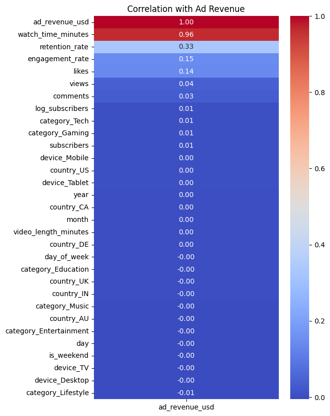
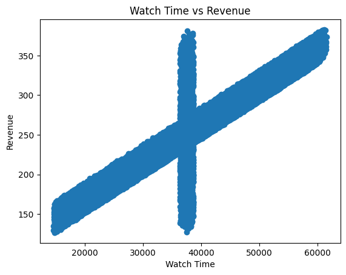
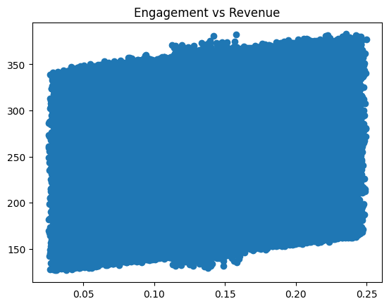
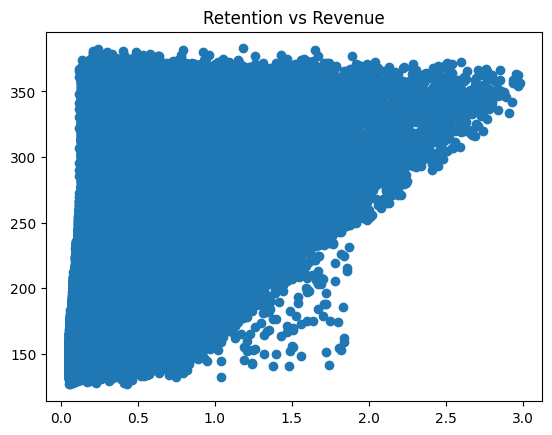
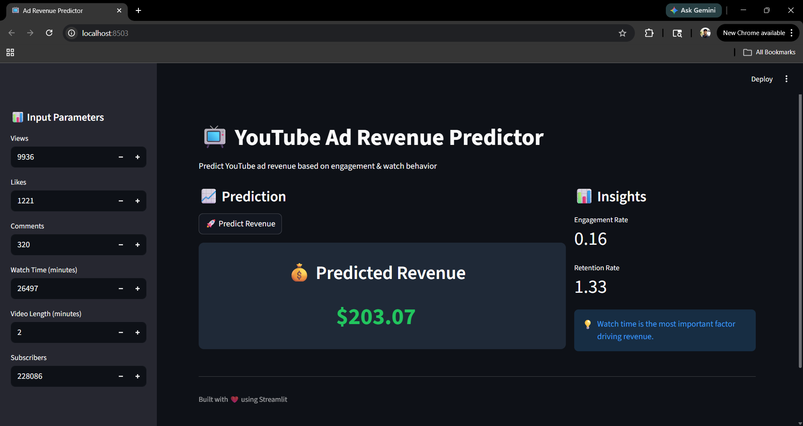

# 📺 Content Monetization Modeler – YouTube Ad Revenue Prediction

## 📌 Project Overview
This project presents an end-to-end machine learning solution for predicting YouTube ad revenue based on video performance metrics. It covers data cleaning, feature engineering, exploratory data analysis (EDA), model building, and deployment using Streamlit.

The objective is to identify key drivers of monetization and build a reliable predictive model that estimates ad revenue based on engagement and watch behavior.

---

## 🎯 Business Objectives
- Predict ad revenue using video performance metrics  
- Identify key factors influencing monetization  
- Understand the impact of engagement and retention  
- Compare multiple regression models  
- Build an interactive prediction application  

---

## 🛠️ Tech Stack
- Python (Pandas, NumPy) – Data Cleaning & Feature Engineering  
- Matplotlib, Seaborn – Data Visualization & EDA  
- Scikit-learn – Machine Learning Models  
- Streamlit – Deployment & UI  
- GitHub – Version Control  

---

## 📂 Dataset Details
- Size: ~120,000 records  
- Domain: Digital Content / YouTube Analytics  

### Key Features:
- Views  
- Likes  
- Comments  
- Watch Time (minutes)  
- Video Length  
- Subscribers  
- Category, Device, Country  

---

## 🔧 Data Cleaning & Feature Engineering
- Removed duplicate records  
- Handled missing values using group-based imputation  
- Converted date fields into structured components  
- Standardized categorical variables  

### Created Features:
- Retention Rate  
  `watch_time / (views × video_length)`  

- Engagement Rate  
  `(likes + comments) / views`  

- Log Subscribers  
  `log(1 + subscribers)`  

---

## 🧠 Key Insights & Analysis

### 📈 Revenue Drivers
- Watch time is the strongest predictor (correlation ≈ 0.96)  
- Engagement and retention moderately influence revenue  
- Views alone have very low impact  

### 📊 Model Behavior Insight
- Strong linear relationship between watch time and revenue  
- Vertical clusters indicate hidden variables  


### 🔍 Feature Importance
- High impact: Watch time, retention, engagement  
- Moderate: Likes, comments  
- Low impact: Views, subscribers  
- Negligible: Category, device, country  

---

## 📊 Visualizations

### 🔥 Correlation Heatmap


### 📈 Watch Time vs Revenue


### 💬 Engagement vs Revenue


### ⏱️ Retention vs Revenue


---

## 🤖 Model Building & Comparison

| Model | Test R² | MAE | RMSE |
|------|--------|------|------|
| Linear Regression | 0.95248 | 3.097 | 13.49 |
| Ridge Regression | 0.95248 | 3.094 | 13.49 |
| **Lasso Regression** | **0.95248** | **3.082** | **13.49** |
| Random Forest | 0.95128 | 3.62 | 13.66 |
| Gradient Boosting | 0.95213 | 3.64 | 13.54 |
| Decision Tree | 0.898 | 5.72 | 19.76 |

---

## 🏆 Final Model Selection – Lasso Regression

### Why Lasso?
- Lowest MAE (most accurate predictions)  
- Maintains high R² (~0.95)  
- Performs automatic feature selection  
- Reduces noise and redundancy  
- Simple, interpretable, and efficient  

---

## 🌐 Streamlit Application

The project is deployed as an interactive web application where users can input video metrics and predict ad revenue in real time.

### Features:
- Sidebar input controls  
- Real-time prediction  
- Clean UI with insights  

### 📊 App Preview


---

## 🚀 Key Outcomes
- Built an end-to-end ML pipeline (data → model → deployment)  
- Identified watch time as the dominant revenue driver  
- Demonstrated that simple models outperform complex ones  
- Delivered a production-ready Streamlit application  

---

## 📁 Project Structure

```
content_monetization_modeler/
│
├── 01_data_cleaning.ipynb
├── 02_eda.ipynb
├── 03_model_training.ipynb
│
├── app.py
├── model.pkl
├── columns.pkl
│
├── photos/
│   ├── 01_data_visualization.png
│   ├── 02_data_visualization.png
│   ├── 03_data_visualization.png
│   ├── 04_data_visualization.png
│   ├── streamlit.png
│
├── README.md
├── requirements.txt
├── LICENSE
```


## 💬 Conclusion
This project demonstrates the ability to transform raw data into actionable insights using machine learning. It highlights strong skills in data preprocessing, feature engineering, model evaluation, and deployment.

---

## 👤 Author
Gopinath S
